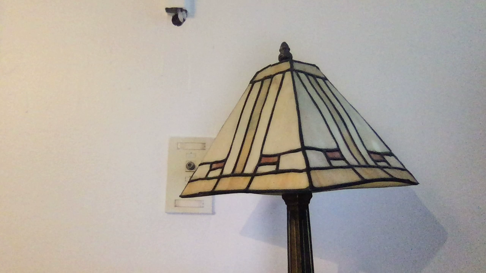
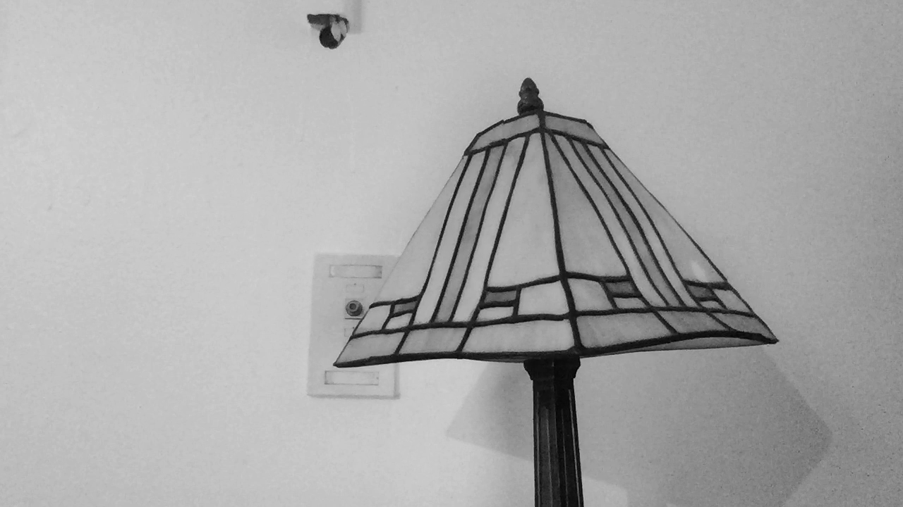
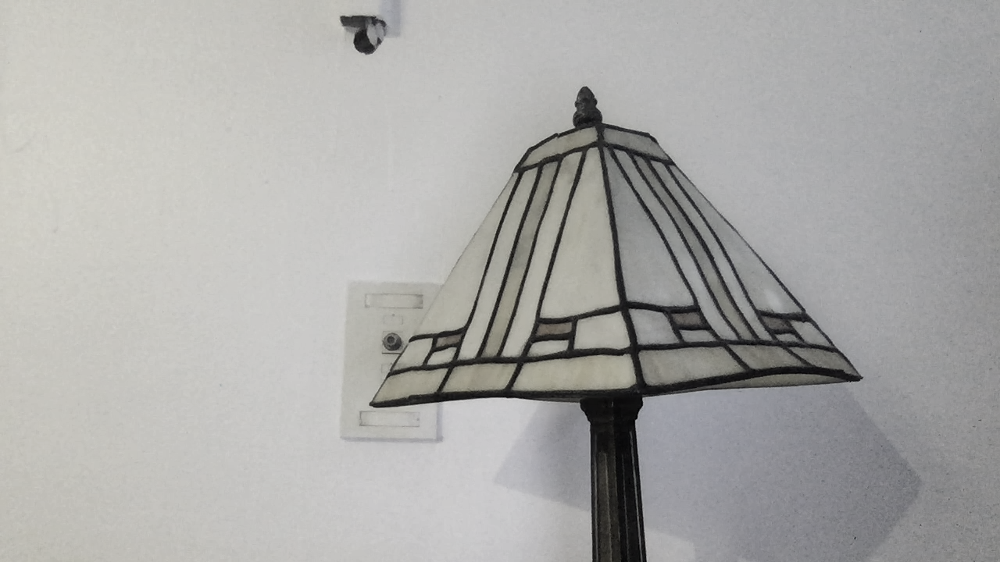
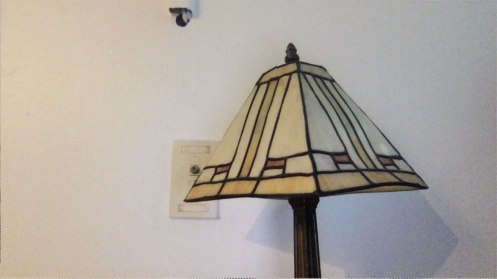
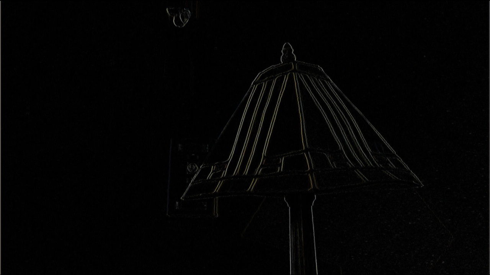
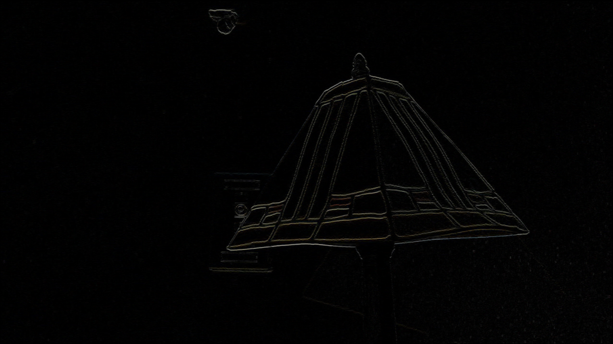
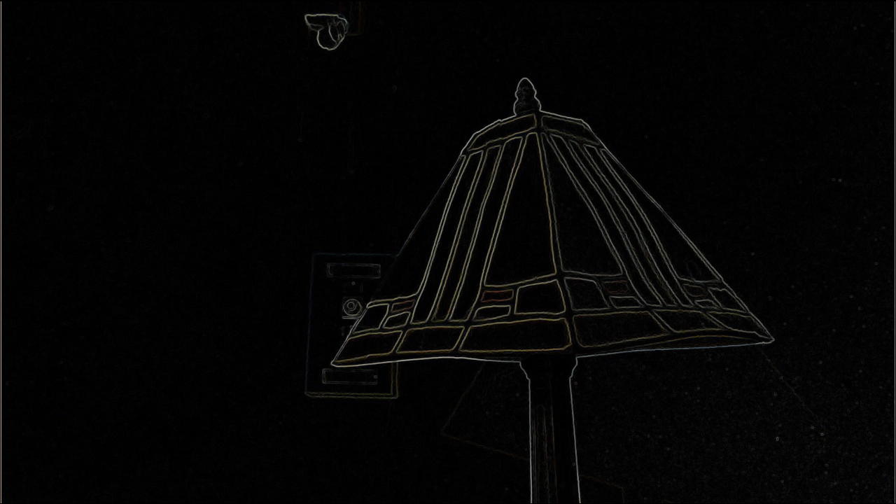
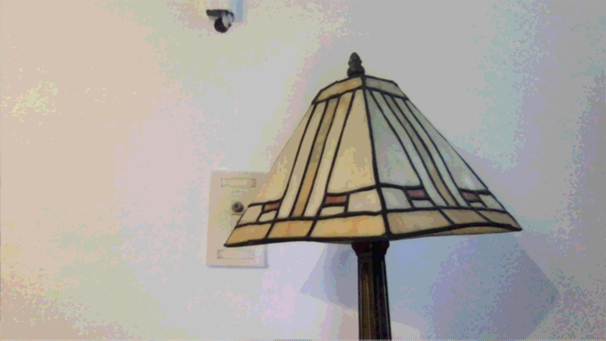
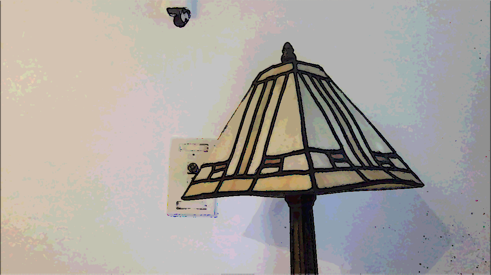
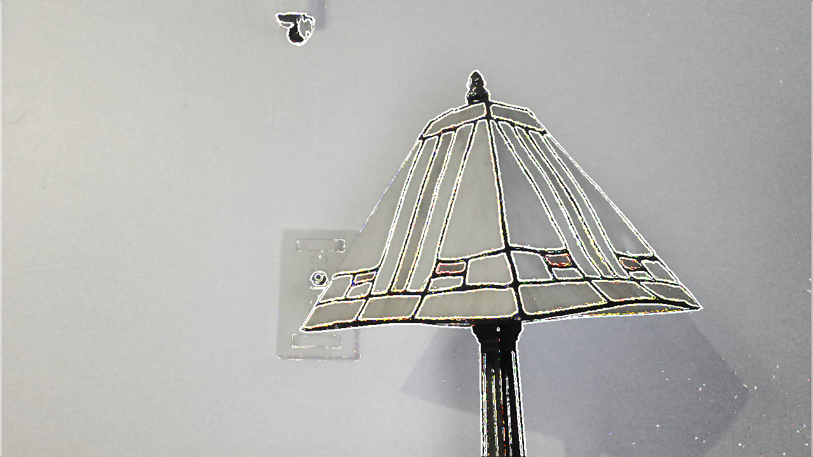

# Project 1: Real-time image filtering system

### Operating system and IDE used to run and compile code

Mac OS, terminal, cmake, and tmux

### Instructions for running executables

1. Place all files from the "vid_display" directory (filter.cpp, filter.h, vidDisplay.cpp, CMakeLists.txt)  into a directory on user's own OS (i.e. assume it's called "vid_display")  
2. Create a directory within the "vid_display" directory called "build".  
3. Inside the "build" directory enter "cmake .." in command line followed by "make".  
4. The user can now run the code by entering "./project1" in the command line.

### Description

This project is a C/C++ and OpenCV implementation of various real-time image filtering functions. The program consists of the following files: "vidDisplay.cpp," "filter.cpp," "filter.h," as well as a "CMakeLists.txt" file that aids in code compilation using CMake. The "vidDisplay.cpp" file implements the main function, which opens a live video channel, creates a window, and displays a new frame through a loop. If the user types 'q,' the program will exit out of the loop that keeps the video capture open and the entire program will terminate. Additional keypress conditionals are implemented within the video capture loop, and they include 's' for saving images as .png files, and other keypresses for calling each filter function in the "filter.cpp" executable file. Aside from the first greyscale filter implementation that used the built-in OpenCV cvtColor() function, the rest of the filter functions manipulated individual pixels stored in the cv::Mat matrix format. In doing so, the filter functions had to assign the proper size and data types to each cv::Mat object that would then specify the correct color channel depth and the number of color channels. Each pixel is manipulated via various operations, such as convolution via separable x and y kernels, calculating the Euclidian distance for magnitude, and color quantization. 

### Filtered Image Sample Outputs

#### Original Image

#### cvtColor() Greyscale

#### Average Greyscale

#### Gaussian Blur

#### Sobel X

#### Sobel Y

#### Gradient Magnitude

#### Blur and Quantize

#### Cartoonized

Cartoon video clip: https://drive.google.com/file/d/1VH6HbUszX0352z7_PlvPN_wfrOIJg-UF/view?usp=sharing

#### Custom

